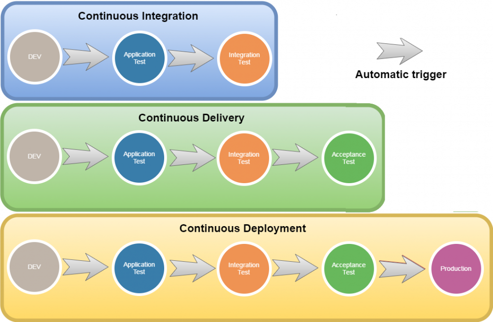
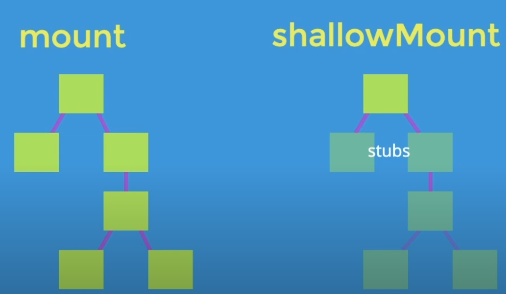

# Learn Testing on Vue

## Benefits of implementing tests

The effort at the beginning is higher, but in the long term it will be compensated
saving time and money.


## Types of test

- **Unit Tests:** They are the modular tests of each component or module separately.
- **Integration Tests:** As integrated modules work with others, this is done with modules or components that have different dependencies.
- **End to End Test:** Prueban todo el sistema, es decir funcionalidades completas como el login, desde el frontend hasta la base de datos.
- **UI Tests:** Functional manual tests from the client, these tests can be automated by simulating behavior with fake users and in different environments.


## DEVOPS

- **AUTOMATING DEVELOPMENT**
  The ideal in projects is to have the ability to automate the different types of tests up to the process of deploying in production. [CI-CD](https://en.wikipedia.org/wiki/CI/CD#In_software_engineering)



  <h1 align="center">   
  
  _"If you don't measure what you do, you can't control it..."_\
  _"And if it can't be controlled, it can't be directed..."_\
  _"And if it can't be directed, it can't be improved..."_

  </h1>
</p>

# Concepts of Jest in Vue



## Comprobar si renderiza el componente

```javascript
import Component from '@/components/Component'
import { shallowMount } from '@vue/test-utils'

describe('Component', () => {
  it('it renders the component', () => {
    const wrapper = shallowMount(Component)
    expect(wrapper.html()).toMatchSnapshot()
  })
})
```

- **Crea un Snapshot:** Es un html renderizado del momento.

Si un snapshot esta registrado y el componente cambia, el test falla. Para aceptar los cambios
se ejecuta el comando de --watchAll indicando un update.
